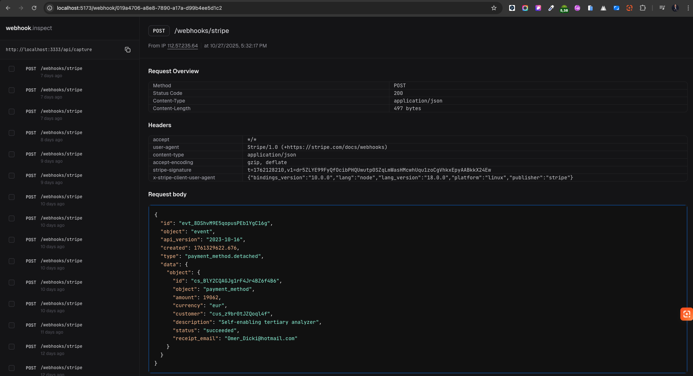

# Projeto Node + React

> Instruções mínimas para instalar, rodar em desenvolvimento e ver as tecnologias usadas.

## Pré-requisitos

- Node.js (18+ recomendado)
- pnpm (o projeto usa pnpm como package manager)
- Postgres (se for usar a camada de banco do `api`)

# Projeto Node + React

<p align="center">
	
</p>

<p align="center"><em>Screenshot do Web UI do projeto — Webhook Inspector</em></p>

> Instruções mínimas para instalar, rodar em desenvolvimento e ver as tecnologias usadas.

## Pré-requisitos

- Node.js (18+ recomendado)
- pnpm (o projeto usa pnpm como package manager)
- Postgres (se for usar a camada de banco do `api`)

## Instalação

1. No diretório raiz do projeto rode:

```bash
pnpm install
```

Isso instalará as dependências de todo o workspace (`api` e `web`).

2. Configure variáveis de ambiente para o backend (`api`) se necessário. Verifique `api/.env` ou `api/src/env.ts` para as chaves esperadas.

## Uso (desenvolvimento)

Abra dois terminais (um para backend e outro para frontend):

- Rodando o backend (Fastify + TypeScript):

```bash
cd api
pnpm dev
```

ou, a partir da raiz usando filtros do pnpm:

```bash
pnpm --filter api dev
```

- Rodando o frontend (Vite + React):

```bash
cd web
pnpm dev
```

ou, a partir da raiz:

```bash
pnpm --filter web dev
```

Depois disso, o front normalmente estará em `http://localhost:5173` (ou porta indicada pelo Vite) e o backend em `http://localhost:3000` (ver `api/src/server.ts` para a porta exata).

## Build / Produção (resumo rápido)

- Frontend:

```bash
cd web
pnpm build
pnpm preview    # para verificar a build localmente
```

- Backend:

O repositório fornece um script `start` em `api/package.json` que executa `node dist/server.ts`. Para produção você deve transpilar/empacotar o código TypeScript (por exemplo `tsc`, `esbuild` ou outro) gerando `dist/` e então executar:

```bash
pnpm --filter api start
```

Dependendo da implantação, adapte o passo de build do backend.

## Scripts úteis (resumo)

- Na raiz: `pnpm install`
- API: `pnpm --filter api dev`, `pnpm --filter api start`, `pnpm --filter api db:migrate` (Drizzle) 
- Web: `pnpm --filter web dev`, `pnpm --filter web build`, `pnpm --filter web preview`

## Estrutura relevante

- `api/` — backend em TypeScript com Fastify, Drizzle-ORM e scripts para migrações
- `web/` — frontend com React + Vite

## Tecnologias abordadas

- pnpm (monorepo/workspaces)
- Node.js + TypeScript
- Fastify (API)
- Drizzle ORM / drizzle-kit (migrations)
- PostgreSQL (via `pg`)
- Vite + React (frontend)

## Observações

- Este README é propositalmente simples — adicione mais detalhes (variáveis de ambiente, exemplos de requests, instruções de deploy) conforme necessário.

## Contato / Próximos passos

- Para melhorias sugeridas: adicionar um `README` específico em `api/` e `web/` com exemplos e variáveis de ambiente.
